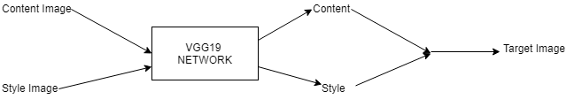

# Basic Tensor

`Tensor` is the base datastructure in `PyTorch`. Every `array like` datastructure is a tensor in this framework.

_Gradient points in the direction of fastest change, so taking -ve and adding to the weigths minimizes loss_

## torch module

---

`import torch`

`torch.manual_seed(seed)`&rarr; sets the seed for the environment globally.

`torch.zeros(shape,required_grad=True)`&rarr; returns a Tensor of zeros of the shape with gradient tracking enabled.

`torch.randn(shape,required_grad=True)`&rarr; returns a Tensor of the given shape randomly from the normal distribution.

`torch.rand_like(Tensor,required_grad=True)`&rarr; returns a Tensor of the same shape of the given tensor randomly from the normal distribution

`torch.sum(Tensor,dim=0|1|2...)`&rarr; sums up and returns a value/Tensor after summing up along the provided axis

`torch.from_numpy(arr)`&rarr; creates a Tensor from a numpy array

`torch.mm(matA,matB)|torch.matmul(matA,matB)`&rarr; does matrix multiplication and returns where matA, matB are tensors with matching dimensions

```python
with torch.no_grad():
    calculation are done here that requires no gradient
    tracking/update, e.g validation/test work on the
    current trained model
```

`torch.set_grad_enabled(True|False)`&rarr; globally turn off/on gradient tracking

`torch.save(StateDictOfModel,PathToSaveFile)`&rarr; saves the statedict of a model in the specified file

`torch.load(PathToSaveFile)`&rarr; loads the statedict of a model and creates a PyTorch model from that.

## Tensor

---

`_`&rarr; at the end means that it's an inplace operation

`tensor.fill_(val)`&rarr; inplace filling of a tensor

`tensor.normal_(mean,sigma)`&rarr; similar to &uarr;

`tensor.mul_(constant)`&rarr; inplace multiplication of the tensor with the constant

`tenor.sum(dim=0|1|..)`&rarr; similar to `torch.sum()`

`tensor.reshape(a,b)`&rarr; returns the tensor in (a,b) shape, may be cloned or not, safety not guarenteed

`tensor.resize_(a,b)`&rarr; inplace operation of the reshape operation, can handle overflow and underflow

`tensor.view(a,b)`&rarr; returns a tensor of the shape `axb` created from it's original shape

`tensor.view(a,-1)`&rarr; returns a tensor with of shape `a` in first axis, the second one is resolved automatically

`tensor.numpy()`&rarr; returns a numpy version of the tensor, but doesn't clone the object, so any change in numpy/tensor is reflected on the whole thing

`tensor.backward()`&rarr; calculates and sets the gradients for all previously tracked Tensors upto current one

`tensor.item()`&rarr; returns the value of a single item `Tensor`

`tensor.type(Tensor.SomeOtherType)`&rarr; changing type of `Tensor`

```text
MATRIX MULTIPLICATION FOR SUMMING UP THE WEIGHTS AND INPUTS
h = [x1,x2,....,xn][
                    [w1],
                    [w2],
                    .
                    .
                    .
                    .
                    .
                    ,
                    [wn]
                    ]
```

`tensor.topk(n,dim=0|1|2...)`&rarr; returns n highest values and index along the dimension

## NN Module

---

`from torch import nn`

### How to use

1. create a new class and subclass `nn.Module`
2. inside `__init__(self):` of the new class, call `super().__init__()` at the very first line
3. create the architecture
4. override/create `def forward(self,x)` method

### Module functionalities

`nn.Linear(inputNumber,outputNumber)`&rarr; creates a Linear layer that takes `inputNumber` inputs and outputs/forwards `outputNumber` outputs

`nn.Sigmoid(dim=0|1|..)`&rarr; a sigmoid activation function

`nn.Softmax(dim=0|1|..)`&rarr; a softmax activation function

`nn.CrossEntropyLoss()`&rarr; a loss function that combines `nn.LogSoftmax()` and `nn.NLLLoss()`

`nn.Dropout(p=probability)`&rarr; drop out probability of the current layer's nodes

`model = nn.Module instance() , preferably a class subclassing from nn.Module`

`model.layerName.weights | model.layerName.bias`&rarr; returns `AutoGrad` variables corresponding to the weights and bias of the layer in consideration

`model.eval()`&rarr; model goes into evaluation mode and sets the `dropout` layers off

`model.train()`&rarr; model goes into training mode and sets the `dropout` layers on

`model.parameters()`&rarr; returns all the parameters of the model

`model.someLayer.parameters()`&rarr; returns the parameters of `someLayer` only

`model.state_dict()`&rarr; returns the `stateDictOfModel` that can be used to save the current state of the model

```python
#Another way to build a model without creating class

model = nn.Sequential(
    nn.SomeLayer1(),
    nn.SomeActivationFunction1(),
    nn.SomeLayer2(),
    nn.SomeActivationFunction2(),
    .
    .
    .
)

logits = model(data) #output of the model
loss = criterion(logits,actualLabels) #calculate loss
```

#### `import torch.nn.functional as F`

Special module providing some static access to different functions.

`F.Sigmoid()`

`F.Softmax()`

## AutoGrads

`model.layerName.weights|bias`&rarr; returns a `AutoGrad` variables, which are different from `Tensor` variables.

`autoGradVariable.data`&rarr; returns a pointer to the `Tensor` inside the variable

## DataSets, `torchvision`

---

`from torchvision import datasets, transforms`

`from torch.utils.data import DataLoader, ImageFolder`

`transofrms.Compose()`&rarr; for composing a pipeline of transforms to do on the loaded data

`transforms.Normalize((mean1,mean2,...),(std1,std2,...))`

`transforms.ToTensor()`&rarr; This should be the last transform in the pipeline

`transofrms.SeeMoreInTheDocks()`&rarr; this module also have image augmentation functions

`DataLoader(tensorData,batachSize,transforms,shuffle...)`&rarr; loads and make batches of the tensorData provided

`iter(dataLoaderObject)`&rarr; returns an iterator, so that we can call: iter.next() to get an image, label from the dataLoader

`ImageFolder(pathToImageFolder, transforms)`&rarr; loads data from imagefolder, where the folder is organized for general image classification.

`datasets.DataSetName(rootToSave,and other flags)`&rarr; for using the general datasets

## Optimizers

---

`from torch import optim`

`optim module`&rarr; contains implementations of common and useful optimizers that can be used to train our model

`optim.SGD(modelParameters,learningRate)`

`optimizer.zero_grad()`&rarr; clears the current accumulated gradients, must be performed before backward pass

`optimizer.step()`&rarr; updates the gradients, i.e. takes a step

## SIMPLE NEURAL NETWORK

### Training

```python
epochs = 5
for e in range(epochs):
    running_loss = 0 #loss in current epoch
    for images, labels in trainloader:

        #forwar propagation
        log_ps = model(images) #last layer has LogSoftMax activation
        loss = criterion(log_ps, labels) #loss is NLLLoss() function

        #backward propagation
        optimizer.zero_grad() #zeroing out the gradietns
        loss.backward() #passing the loss backward
        optimizer.step()
        #accumulate loss for viewing purpose
        running_loss += loss.item()
    else:
        print(f"Training loss: {running_loss/len(trainloader)}")
```

### Testing

```python
# ps contains probabilities of all classes, torch.exp() is used on the logits to get the actual probabilities as the activation of outputlayer is LogSoftMax
img,label = (iter(testloader)).next()
ps = torch.exp(model(img))
```

## Transfer Learning

### model building

```python
from torchvision import models

# Use GPU if it's available
device = torch.device("cuda" if torch.cuda.is_available() else "cpu")

model = models.densenet121(pretrained=True)

# Freeze parameters so we don't backprop through them
for param in model.parameters():
    param.requires_grad = False

#our own classifier is added as the classifier of the densenet
model.classifier = nn.Sequential(nn.Linear(1024, 256),
                                 nn.ReLU(),
                                 nn.Dropout(0.2),
                                 nn.Linear(256, 2),
                                 nn.LogSoftmax(dim=1))

#our own criterion for loss
criterion = nn.NLLLoss()

# Only train the classifier parameters, feature parameters are frozen
optimizer = optim.Adam(model.classifier.parameters(), lr=0.003)

#move the mode to cpu/gpu based on availability
model.to(device);
```

## Training with vailadtion

```python
epochs = 1
steps = 0
running_loss = 0
print_every = 5

for epoch in range(epochs):
    for inputs, labels in trainloader:
        steps += 1
        # Move input and label tensors to the default device
        inputs, labels = inputs.to(device), labels.to(device)

        #zero out the accumulated gradients
        optimizer.zero_grad()

        #forward pas
        logps = model.forward(inputs)
        loss = criterion(logps, labels)

        #backwardpass
        loss.backward()
        optimizer.step()

        running_loss += loss.item()

        #validation step
        if steps % print_every == 0:
            test_loss = 0
            accuracy = 0

            #turn off dropout layers
            model.eval()

            #do not accumulate gradients for the  testset
            with torch.no_grad():
                for inputs, labels in testloader:
                    inputs, labels = inputs.to(device), labels.to(device)

                    #forward pass
                    logps = model.forward(inputs)
                    batch_loss = criterion(logps, labels)

                    #loss accumulation
                    test_loss += batch_loss.item()

                    # Calculate accuracy
                    ps = torch.exp(logps)
                    top_p, top_class = ps.topk(1, dim=1)
                    equals = top_class == labels.view(*top_class.shape)
                    accuracy += torch.mean(equals.type(torch.FloatTensor)).item()

            print(f"Epoch {epoch+1}/{epochs}.. "
                  f"Train loss: {running_loss/print_every:.3f}.. "
                  f"Test loss: {test_loss/len(testloader):.3f}.. "
                  f"Test accuracy: {accuracy/len(testloader):.3f}")
            running_loss = 0

            #turn on dropout layers
            model.train()
```

## Loading Data With Train-Validation-Test Split

```python
# how many samples per batch to load
batch_size = 20
# percentage of training set to use as validation
valid_size = 0.2

# convert data to torch.FloatTensor
transform = transforms.ToTensor()

# choose the training and test datasets
train_data = datasets.MNIST(root='data', train=True,
                                   download=True, transform=transform)
test_data = datasets.MNIST(root='data', train=False,
                                  download=True, transform=transform)

# obtain training indices that will be used for validation
num_train = len(train_data)
indices = list(range(num_train))
np.random.shuffle(indices)
split = int(np.floor(valid_size * num_train))
train_idx, valid_idx = indices[split:], indices[:split]

# define samplers for obtaining training and validation batches
train_sampler = SubsetRandomSampler(train_idx)
valid_sampler = SubsetRandomSampler(valid_idx)

# prepare data loaders
train_loader = torch.utils.data.DataLoader(train_data, batch_size=batch_size,
    sampler=train_sampler, num_workers=num_workers)
valid_loader = torch.utils.data.DataLoader(train_data, batch_size=batch_size,
    sampler=valid_sampler, num_workers=num_workers)
test_loader = torch.utils.data.DataLoader(test_data, batch_size=batch_size,
    num_workers=num_workers)
```

## Training Model With Validation Loss and Stopping

```python

# number of epochs to train the model
n_epochs = 50

# initialize tracker for minimum validation loss
valid_loss_min = np.Inf # set initial "min" to infinity

for epoch in range(n_epochs):
    # monitor training loss
    train_loss = 0.0
    valid_loss = 0.0

    ###################
    # train the model #
    ###################
    model.train() # prep model for training
    for data, target in train_loader:
        # clear the gradients of all optimized variables
        optimizer.zero_grad()
        # forward pass: compute predicted outputs by passing inputs to the model
        output = model(data)
        # calculate the loss
        loss = criterion(output, target)
        # backward pass: compute gradient of the loss with respect to model parameters
        loss.backward()
        # perform a single optimization step (parameter update)
        optimizer.step()
        # update running training loss
        train_loss += loss.item()*data.size(0)

    ######################
    # validate the model #
    ######################
    model.eval() # prep model for evaluation
    for data, target in valid_loader:
        # forward pass: compute predicted outputs by passing inputs to the model
        output = model(data)
        # calculate the loss
        loss = criterion(output, target)
        # update running validation loss
        valid_loss += loss.item()*data.size(0)

    # print training/validation statistics
    # calculate average loss over an epoch
    train_loss = train_loss/len(train_loader.dataset)
    valid_loss = valid_loss/len(valid_loader.dataset)

    print('Epoch: {} \tTraining Loss: {:.6f} \tValidation Loss: {:.6f}'.format(
        epoch+1,
        train_loss,
        valid_loss
        ))

    # save model if validation loss has decreased
    if valid_loss <= valid_loss_min:
        print('Validation loss decreased ({:.6f} --> {:.6f}).  Saving model ...'.format(
        valid_loss_min,
        valid_loss))
        torch.save(model.state_dict(), 'model.pt')
        valid_loss_min = valid_loss

```

## Testing Model With Class-wise Accuracy

```python
# initialize lists to monitor test loss and accuracy
test_loss = 0.0
class_correct = list(0. for i in range(10))
class_total = list(0. for i in range(10))

model.eval() # prep model for evaluation

for data, target in test_loader:
    # forward pass: compute predicted outputs by passing inputs to the model
    output = model(data)
    # calculate the loss
    loss = criterion(output, target)
    # update test loss
    test_loss += loss.item()*data.size(0)
    # convert output probabilities to predicted class
    _, pred = torch.max(output, 1)
    # compare predictions to true label
    correct = np.squeeze(pred.eq(target.data.view_as(pred)))
    # calculate test accuracy for each object class
    for i in range(batch_size):
        label = target.data[i]
        class_correct[label] += correct[i].item()
        class_total[label] += 1

# calculate and print avg test loss
test_loss = test_loss/len(test_loader.dataset)
print('Test Loss: {:.6f}\n'.format(test_loss))

for i in range(10):
    if class_total[i] > 0:
        print('Test Accuracy of %5s: %2d%% (%2d/%2d)' % (
            str(i), 100 * class_correct[i] / class_total[i],
            np.sum(class_correct[i]), np.sum(class_total[i])))
    else:
        print('Test Accuracy of %5s: N/A (no training examples)' % (classes[i]))

print('\nTest Accuracy (Overall): %2d%% (%2d/%2d)' % (
    100. * np.sum(class_correct) / np.sum(class_total),
    np.sum(class_correct), np.sum(class_total)))

```

## CNN: Convolutional Neural Networks

⇒ In `Pytorch`, there is no automatic GPU switching like in `Keras`, we need to move the model to train and data to the `device` prior to training or testing suitably

#### MLP

Image Classification ⇒ Flatten the image in one dimension → normalize pixel values → feed forward → classification score

Flattened Image is needed ⇒ MLP only takes flattended input

**During Flattening of an Image, the spatial information is lost, this is why, normal MLP is bad at Image Classification**

#### CNN

1. uses sparsely connected layers
2. can accept 2D images
3. has special properties: `local connectivity` and `parameter sharing`

**High Frequency Component** ⇒ edges of objects in images

**High Pass Filters** ⇒ sharpen an image → enhances high frequency parts of an image → emphasizes edges

#### Why Regular Neural Networks Don't Scale Well to Full Images

`CIFAR-10` ⇒ each image is 32x323 ⇒ 3072 parameters

so, one neuron in the first layer will have 3072 weights

So,

Image_size⇑ ⇒ parameters  add up to be a huge number, which is hard to manage

Huge number of parameters ⇒ Prone to overfitting

#### 3D Volumes of Neurons

In ConvNets, neurons are arranged in 3 dimensions ⇒ Often called 3D volume of activation

E.G: CIFAR-10 has a 3D input volume activation of shape 32x32x3 as

#### ConvLayers

Parameters ⇒ set of learnable filters

Each filter ⇒ spatially small but has full depth

Each filter slide across height and width dimension of the image and generate a 2D activation map which is equivalent to response of the filter at every spatial positions.

When we have more than one filter ⇒ we get separate 2D activation map ⇒ Stacking these 2D activation maps along `depth` dimension ⇒ Output volume of the layer

This is how each ConvLayer generates outputs.

#### Local Connectivity

Each neuron is connected to a local region of the input volume. Here, the `extent` of connectivity is always `equal` to the input volume along the `depth` axis, i.e. one neuron in the next layer is connected to a `limited region` of the previous layer in X and Y dimension, but connected in full in the Z dimension.

**Example:**

Let,

CIFAR-10 Images $\Rightarrow$ [32x32x3]

Filter size $\Rightarrow$ [3x3] $\Rightarrow$ A neuron in the first hidden layer will have (3x3x3) = 27 weights, as it'll be connected to a (3x3) area of the input image in X-Y dimension and to the full extent in the depth dimension.

Similary, Filter size $\Rightarrow$ [5x5] $\Rightarrow$ A neuron in the first hidden layer will have (5x5x3) = 75 weights.

#### Parameter Sharing

Even with local connectivity, the number of weights, i.e. paramters we need to train can become very very large depending on the input image size. `Parameter Sharing` scheme is used to compensate for that and it can reduce the number of parameters to train drastically.

Let,

input $\Rightarrow$ [227x227x3]

Filter size $\Rightarrow$ [11x11]

Padding $\Rightarrow$ 0

Stride $\Rightarrow$ 4

Number of filters $\Rightarrow$ 96

$\therefore$ Output of 1st Layer $\Rightarrow$ [55x55x96]

Here every neuron in the first hidden layer is connected to an area of (11x11x3) of the input. So, every neuron has 363+1(bias) = 364 parameters to train. The output of the input layer in the given configuration needs, (55x55x96) neurons. So, there are (55x55x96)x364 = 105,705,600 parameters to train. This is very huge for just training one layer.

One assumption $\Rightarrow$ dramatic reduction in number of parameters $\Downarrow$

If a feature is useful to compute in some region $(x_1,y_1)$, it should be useful to compute at a different position $(x_2,y_2)$. So, in a 2D depth slice $\Rightarrow$ We constrain the neurons to use the same weights and bias.

So, in first convLayer of the example $\Rightarrow$ 96x11x11x3 +96 = 34848+96 parameters need to be trained. I.e. all of (55x55) neurons in the same depth slice, uses the same weights as parameters and tunes them accordingly.


#### Insights

If we want to,

1. Increase Nodes in a CNN layer $\Rightarrow$ increase number of filters
2. Increase Size of detected pattern $\Rightarrow$ increase size of the filters used

#### Some Calculation

Let,

Input volume $\Rightarrow [W_1*H_1*D_1]$

Filter Size $\Rightarrow [F_1*F_2]$

Padding $\Rightarrow P$

Stride $\Rightarrow S$

Number of filters $\Rightarrow K$

Then, output volume of this layer need to have size $\Rightarrow [W_2*H_2*D_2]$

Where,

$W_2=(W_1-F_1+2P)/S+1$

$H_2=(H_1-F_2+2P)/S+1$

$D_2=K$

### Pytorch Code For Convolutional Neural Networks

#### Check For CUDA and GPU

```python
import torch
import numpy as np

# check if CUDA is available
train_on_gpu = torch.cuda.is_available()

if not train_on_gpu:
    print('CUDA is not available.  Training on CPU ...')
else:
    print('CUDA is available!  Training on GPU ...')
```

#### Loading and Augmentation of Data

```python
from torchvision import datasets
import torchvision.transforms as transforms
from torch.utils.data.sampler import SubsetRandomSampler

# number of subprocesses to use for data loading
num_workers = 0
# how many samples per batch to load
batch_size = 20
# percentage of training set to use as validation
valid_size = 0.2

# convert data to a normalized torch.FloatTensor
transform = transforms.Compose([
    transforms.RandomHorizontalFlip(), # randomly flip and rotate
    transforms.RandomRotation(10),
    transforms.ToTensor(),
    transforms.Normalize((0.5, 0.5, 0.5), (0.5, 0.5, 0.5))
    ])

# choose the training and test datasets
train_data = datasets.CIFAR10('data', train=True,
                              download=True, transform=transform)
test_data = datasets.CIFAR10('data', train=False,
                             download=True, transform=transform)

# obtain training indices that will be used for validation
num_train = len(train_data)
indices = list(range(num_train))
np.random.shuffle(indices)
split = int(np.floor(valid_size * num_train))
train_idx, valid_idx = indices[split:], indices[:split]

# define samplers for obtaining training and validation batches
train_sampler = SubsetRandomSampler(train_idx)
valid_sampler = SubsetRandomSampler(valid_idx)

# prepare data loaders (combine dataset and sampler)
train_loader = torch.utils.data.DataLoader(train_data, batch_size=batch_size,
    sampler=train_sampler, num_workers=num_workers)
valid_loader = torch.utils.data.DataLoader(train_data, batch_size=batch_size, 
    sampler=valid_sampler, num_workers=num_workers)
test_loader = torch.utils.data.DataLoader(test_data, batch_size=batch_size, 
    num_workers=num_workers)

# specify the image classes
classes = ['airplane', 'automobile', 'bird', 'cat', 'deer',
           'dog', 'frog', 'horse', 'ship', 'truck']
```

#### Data visualization

```python
import matplotlib.pyplot as plt
%matplotlib inline

# helper function to un-normalize and display an image
def imshow(img):
    img = img / 2 + 0.5  # unnormalize
    plt.imshow(np.transpose(img, (1, 2, 0)))  # convert from Tensor image

# obtain one batch of training images
dataiter = iter(train_loader)
images, labels = dataiter.next()
images = images.numpy() # convert images to numpy for display

# plot the images in the batch, along with the corresponding labels
fig = plt.figure(figsize=(25, 4))
# display 20 images
for idx in np.arange(20):
    ax = fig.add_subplot(2, 20/2, idx+1, xticks=[], yticks=[])
    imshow(images[idx])
    ax.set_title(classes[labels[idx]])
```

#### Visualize one image in detail

```python
rgb_img = np.squeeze(images[3])
channels = ['red channel', 'green channel', 'blue channel']

fig = plt.figure(figsize = (36, 36)) 
for idx in np.arange(rgb_img.shape[0]):
    ax = fig.add_subplot(1, 3, idx + 1)
    img = rgb_img[idx]
    ax.imshow(img, cmap='gray')
    ax.set_title(channels[idx])
    width, height = img.shape
    thresh = img.max()/2.5
    for x in range(width):
        for y in range(height):
            val = round(img[x][y],2) if img[x][y] !=0 else 0
            ax.annotate(str(val), xy=(y,x),
                    horizontalalignment='center',
                    verticalalignment='center', size=8,
                    color='white' if img[x][y]<thresh else 'black')
```

#### Network Definition

```python
import torch.nn as nn
import torch.nn.functional as F

# define the CNN architecture
class Net(nn.Module):
    def __init__(self):
        super(Net, self).__init__()
        # convolutional layer (sees 32x32x3 image tensor)
        self.conv1 = nn.Conv2d(3, 16, 3, padding=1)
        # convolutional layer (sees 16x16x16 tensor)
        self.conv2 = nn.Conv2d(16, 32, 3, padding=1)
        # convolutional layer (sees 8x8x32 tensor)
        self.conv3 = nn.Conv2d(32, 64, 3, padding=1)
        # max pooling layer
        self.pool = nn.MaxPool2d(2, 2)
        # linear layer (64 * 4 * 4 -> 500)
        self.fc1 = nn.Linear(64 * 4 * 4, 500)
        # linear layer (500 -> 10)
        self.fc2 = nn.Linear(500, 10)
        # dropout layer (p=0.25)
        self.dropout = nn.Dropout(0.25)

    def forward(self, x):
        # add sequence of convolutional and max pooling layers
        x = self.pool(F.relu(self.conv1(x)))
        x = self.pool(F.relu(self.conv2(x)))
        x = self.pool(F.relu(self.conv3(x)))
        # flatten image input
        x = x.view(-1, 64 * 4 * 4)
        # add dropout layer
        x = self.dropout(x)
        # add 1st hidden layer, with relu activation function
        x = F.relu(self.fc1(x))
        # add dropout layer
        x = self.dropout(x)
        # add 2nd hidden layer, with relu activation function
        x = self.fc2(x)
        return x

# create a complete CNN
model = Net()
print(model)

# move tensors to GPU if CUDA is available
if train_on_gpu:
    model.cuda()
```

#### Loss and Optimizer selection

```python
import torch.optim as optim

# specify loss function (categorical cross-entropy)
criterion = nn.CrossEntropyLoss()

# specify optimizer
optimizer = optim.SGD(model.parameters(), lr=0.01)
```

#### Train the network

```python

# number of epochs to train the model
n_epochs = 30

valid_loss_min = np.Inf # track change in validation loss

for epoch in range(1, n_epochs+1):

    # keep track of training and validation loss
    train_loss = 0.0
    valid_loss = 0.0
    
    ###################
    # train the model #
    ###################
    model.train()
    for batch_idx, (data, target) in enumerate(train_loader):
        # move tensors to GPU if CUDA is available
        if train_on_gpu:
            data, target = data.cuda(), target.cuda()
        # clear the gradients of all optimized variables
        optimizer.zero_grad()
        # forward pass: compute predicted outputs by passing inputs to the model
        output = model(data)
        # calculate the batch loss
        loss = criterion(output, target)
        # backward pass: compute gradient of the loss with respect to model parameters
        loss.backward()
        # perform a single optimization step (parameter update)
        optimizer.step()
        # update training loss
        train_loss += loss.item()*data.size(0)
        
    ######################    
    # validate the model #
    ######################
    model.eval()
    for batch_idx, (data, target) in enumerate(valid_loader):
        # move tensors to GPU if CUDA is available
        if train_on_gpu:
            data, target = data.cuda(), target.cuda()
        # forward pass: compute predicted outputs by passing inputs to the model
        output = model(data)
        # calculate the batch loss
        loss = criterion(output, target)
        # update average validation loss 
        valid_loss += loss.item()*data.size(0)
    
    # calculate average losses
    train_loss = train_loss/len(train_loader.dataset)
    valid_loss = valid_loss/len(valid_loader.dataset)
        
    # print training/validation statistics 
    print('Epoch: {} \tTraining Loss: {:.6f} \tValidation Loss: {:.6f}'.format(
        epoch, train_loss, valid_loss))
    
    # save model if validation loss has decreased
    if valid_loss <= valid_loss_min:
        print('Validation loss decreased ({:.6f} --> {:.6f}).  Saving model ...'.format(
        valid_loss_min,
        valid_loss))
        torch.save(model.state_dict(), 'model_augmented.pt')
        valid_loss_min = valid_loss
```

#### Restore the model with lowest validation accuracy

```python
model.load_state_dict(torch.load('model_augmented.pt'))
```

#### Test the model

```python
# track test loss
test_loss = 0.0
class_correct = list(0. for i in range(10))
class_total = list(0. for i in range(10))

model.eval()
# iterate over test data
for batch_idx, (data, target) in enumerate(test_loader):
    # move tensors to GPU if CUDA is available
    if train_on_gpu:
        data, target = data.cuda(), target.cuda()
    # forward pass: compute predicted outputs by passing inputs to the model
    output = model(data)
    # calculate the batch loss
    loss = criterion(output, target)
    # update test loss 
    test_loss += loss.item()*data.size(0)
    # convert output probabilities to predicted class
    _, pred = torch.max(output, 1)    
    # compare predictions to true label
    correct_tensor = pred.eq(target.data.view_as(pred))
    correct = np.squeeze(correct_tensor.numpy()) if not train_on_gpu else np.squeeze(correct_tensor.cpu().numpy())
    # calculate test accuracy for each object class
    for i in range(batch_size):
        label = target.data[i]
        class_correct[label] += correct[i].item()
        class_total[label] += 1

# average test loss
test_loss = test_loss/len(test_loader.dataset)
print('Test Loss: {:.6f}\n'.format(test_loss))

for i in range(10):
    if class_total[i] > 0:
        print('Test Accuracy of %5s: %2d%% (%2d/%2d)' % (
            classes[i], 100 * class_correct[i] / class_total[i],
            np.sum(class_correct[i]), np.sum(class_total[i])))
    else:
        print('Test Accuracy of %5s: N/A (no training examples)' % (classes[i]))

print('\nTest Accuracy (Overall): %2d%% (%2d/%2d)' % (
    100. * np.sum(class_correct) / np.sum(class_total),
    np.sum(class_correct), np.sum(class_total)))
```

#### Visualize sample test results

```python
# obtain one batch of test images
dataiter = iter(test_loader)
images, labels = dataiter.next()
images.numpy()

# move model inputs to cuda, if GPU available
if train_on_gpu:
    images = images.cuda()

# get sample outputs
output = model(images)
# convert output probabilities to predicted class
_, preds_tensor = torch.max(output, 1)
preds = np.squeeze(preds_tensor.numpy()) if not train_on_gpu else np.squeeze(preds_tensor.cpu().numpy())

# plot the images in the batch, along with predicted and true labels
fig = plt.figure(figsize=(25, 4))
for idx in np.arange(20):
    ax = fig.add_subplot(2, 20/2, idx+1, xticks=[], yticks=[])
    imshow(images[idx])
    ax.set_title("{} ({})".format(classes[preds[idx]], classes[labels[idx]]),
                 color=("green" if preds[idx]==labels[idx].item() else "red"))
```

## Style Transfer

Image style transfer is based on the paper called [Image Style Transfer Using Convolutional Neural Networks](https://www.cv-foundation.org/openaccess/content_cvpr_2016/papers/Gatys_Image_Style_Transfer_CVPR_2016_paper.pdf). The basic idea and corresponding code are explained below:

ConvLayer $\Rightarrow$ `Feature Extractor` of input images

MaxPoolLayer $\Rightarrow$ Discards `detailed spatial information` which are usually increasingly `irrelevant` for classification task.

Later layer in a model with CNN $\Rightarrow$ care more about content $\Rightarrow$ Content Representation of an Image

Style of an image $\Rightarrow$ relies on correlations between the features in individual layers, i.e. how similar the features of a single layer are to the previous layer

Similarity $\Rightarrow$ includes general color and textures we may find in a layer



In the paper, content representation is taken from Conv4_2.

Let, 

$C_c=$ Content Representation of the Input Image

$T_c=$ Content Representation of the Target Image

Content Loss, $L_c = \frac{1}{2}\sum(C_c-T_c)^2\Rightarrow$ measures how far away the content and target are from each other, so, by minimizing this loss, we can guarentee that the target image becomes more and more similar to the Content Image.

Style Representation $\Rightarrow$ Gram matrix is used for this

**Gram Matrix**:

1. Flatten (X,Y) dimension of 3D volume output of the layer $\Rightarrow$ from left to right and top to bottom, and stack them on each other. Let, X = Flattend output.
2. Gram Matrix = $X^T\cdot X$

Gram matrix contains non-localized information of the image, that is approximately the style of the image.

In gram matrix, $G[i][j]\Rightarrow$ contains the similarities between ith and jth feature map in the layer.

In the paper, gram matrix is calculated in layer: $convN_1 ,\forall N \in [1,5]$

Now, Let,

$S_s=$ Style image's gram matrix list (1~5)

$T_s=$ Target image's gram matrix list (1~5)

Style Loss, $L_s=a\sum w_i(T_s,_i-S_s,_i)^2$

Where,

$a =$ number of values in each layer

$w_i =$ style weights, i.e. how much style from different layers are reflected in the target image

Total loss, $L_T = \alpha L_c + \beta L_s$

Usually, $\beta >> \alpha$

Usually, $\frac{\alpha}{\beta} = \frac{content}{style} ratio$